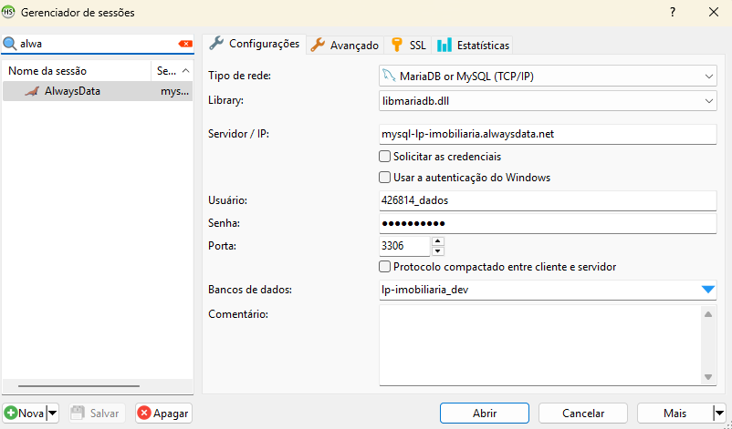
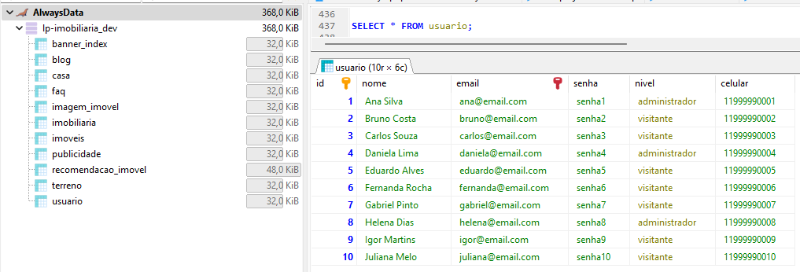

# Banco de dados 
## Banco: [MariaDB](https://mariadb.org/)

O **MariaDB Server** é um dos bancos de dados relacionais de código aberto mais populares.  
Ele foi criado pelos desenvolvedores originais do MySQL e possui a garantia de permanecer como código aberto.  
Faz parte da maioria das ofertas em nuvem e é o padrão na maioria das distribuições Linux.  

O projeto nasceu após a aquisição do MySQL pela Oracle Corporation.  
Embora compartilhem muitas semelhanças — como compatibilidade e sintaxes de comando — o MariaDB é mantido como um projeto independente e de código aberto, permitindo que os usuários do MySQL migrem para o MariaDB sem complicações.


##  Ambientes

### 1. Produção
**Servidores da Faculdade**<br>
Strings de conexão:
```yaml
Em Desenvolvimento
```

### 2. Desenvolvimento
**AlwaysData**<br>
Strings de conexão:
```yaml
database: lp-imobiliaria_dev
host: mysql-lp-imobiliaria.alwaysdata.net
port: 3306
user: Utilizar o user disponibilizado pelo PM do seu produto
password: Utilizar a senha disponibilizada pelo PM do seu produto
```

### 3. Local
**Seu computador 😉**<br>
```yaml
Para rodar localmente, basta criar um banco MySQL local e executar o script disponibilizado neste repositório.  
(Iremos mantê-lo atualizado caso ocorram mudanças)
```

## 📝 Recomendações Gerais:
- As estruturas e relações de tabelas deste banco **não devem ser alteradas** sem a autorização do time de dados.
- No ambiente de <i><b>desenvolvimento</b></i>, todos os usuários possuem acesso liberado para inserções e remoções de dados. Caso necessário, esses acessos poderão ser limitados...
- Recomendamos que o desenvolvimento seja iniciado sempre pelo banco local, pois ele oferece maior liberdade para testes e inserções de dados, menor latência nas consultas e a possibilidade de trabalhar com dados inconsistentes ou incompletos sem impacto no ambiente principal ou de desenvolvimento.

## Exemplo de Conexão (HeidiSQL):
1-Conexão:

2-Execução de Query:


