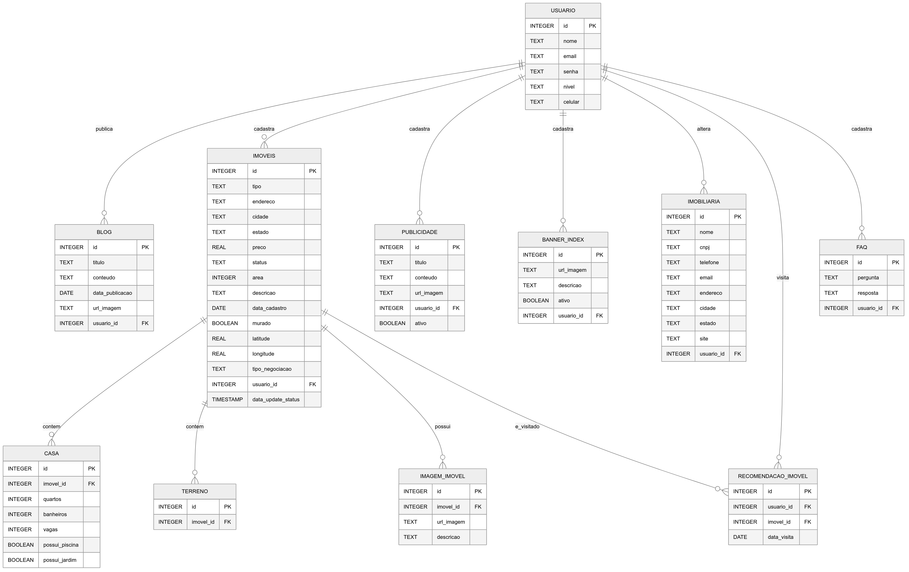

# Banco de dados (MySQL)

## Diagrama:


## Estrutura:

<br> 
<details>
<summary><strong>USUARIO</strong></summary>

| Nome da Coluna | Tipo de Dado                      | Descrição                          |
| -------------- | --------------------------------- | ---------------------------------- |
| id             | INT(11)                           | Identificador único do usuário     |
| nome           | VARCHAR(100)                      | Nome completo do usuário           |
| email          | VARCHAR(100)                      | E-mail do usuário (deve ser único) |
| senha          | VARCHAR(255)                      | Senha criptografada                |
| nivel          | TINYINT(1)                        | Nível de acesso do usuário, 0 = administrador, 1 = visitante         |
| celular        | VARCHAR(20)                       | Número de celular do usuário       |

</details>

*Tabela para armazenar os dados de um usuário cadastrado.*


<br> 
<details>
<summary><strong>IMOVEIS</strong></summary>

| Nome da Coluna | Tipo de Dado       | Descrição                                |
|---------------|--------------------|-------------------------------------------|
| id            | INT(11)           | Identificador único do imóvel            |
| tipo          | VARCHAR(50)       | Tipo do imóvel (ex.: casa, apartamento)  |
| endereco      | VARCHAR(255)      | Endereço do imóvel (ex: Número, rua, bairro) |
| cidade        | VARCHAR(100)      | Cidade onde o imóvel está localizado     |
| estado        | VARCHAR(2)        | Sigla do estado                          |
| preco         | DECIMAL(12,2)     | Preço do imóvel                          |
| status        | VARCHAR(20)       | Status do imóvel (disponivel, indisponivel), esse campo pode ser usado para lógica de mostrar ou não o imóvel no site/mapa |
| area          | INT(11)           | Área do imóvel em m²                     |
| descricao     | TEXT              | Descrição do imóvel                      |
| data_cadastro | DATE              | Data de cadastro do imóvel               |
| murado        | TINYINT(1)        | Indica se o imóvel é murado (0 = não, 1 = sim)    |
| latitude      | DECIMAL(10,7)     | Latitude da localização                  |
| longitude     | DECIMAL(10,7)     | Longitude da localização                 |
| usuario_id    | INT(11)           | ID do usuário que cadastrou o imóvel (Apenas administradores cadastram imóveis)    |
| tipo_negociacao   | ENUM('venda', 'aluguel') | Tipo de proposta do imóvel (Está disponível para venda ou aluguel) - Em caso de um imóvel ser oferecido como ambas opções deve-se cadastrar duas vezes e conectá-lo com a mesma tabela de casa ou de terreno |

</details>

*Tabela para armazenar os dados dos imóveis cadastrados*

<br> 
<details>
<summary><strong>CASA</strong></summary>

| Nome da Coluna   | Tipo de Dado   | Descrição                                |
|-----------------|----------------|-------------------------------------------|
| id              | INT(11)       | Identificador único da casa              |
| imovel_id       | INT(11)       | ID do imóvel relacionado                 |
| quartos         | INT(11)       | Número de quartos                        |
| banheiros       | INT(11)       | Número de banheiros                      |
| vagas           | INT(11)       | Número de vagas de garagem               |
| possui_piscina  | TINYINT(1)    | Indica se a casa possui piscina (0 = não, 1 = sim)|
| possui_jardim   | TINYINT(1)    | Indica se a casa possui jardim (0 = não, 1 = sim) |

</details>

*Tabela para armazenar os dados do imóvel quando for casa*


<br> 
<details>
<summary><strong>TERRENO</strong></summary>

| Nome da Coluna | Tipo de Dado | Descrição                           |
|----------------|--------------|-------------------------------------|
| id             | INT(11)      | Identificador único do terreno      |
| imovel_id      | INT(11)      | ID do imóvel relacionado            |

</details>

*Tabela para armazenar os dados do imóvel quando for terreno*


<br> 
<details>
<summary><strong>IMAGEM_IMOVEL</strong></summary>

| Nome da Coluna | Tipo de Dado   | Descrição                           |
|----------------|----------------|-------------------------------------|
| id             | INT(11)        | Identificador único da imagem       |
| imovel_id      | INT(11)        | ID do imóvel relacionado            |
| url_imagem     | VARCHAR(255)   | Nome da Imagem + extensão (ex: 7ac66c0f1484d64.png) - Deve-se usar um algoritmo de hash (ex: MD5) para garantir que os nomes de imagens não sejam iguais no momento de salvar - As imagens serão guardadas em um mesmo diretório, o banco só guarda o nome único hasheado e o caminho padrão ficará definido no back-end |
| descricao      | VARCHAR(255)   | Descrição da imagem                 |

</details>

*Tabela para armazenar cada imagem do imóvel*


<br> 
<details>
<summary><strong>BANNER_INDEX</strong></summary>

| Nome da Coluna | Tipo de Dado    | Descrição                          |
|----------------|----------------|-------------------------------------|
| id             | INT(11)        | Identificador único                 |
| url_imagem     | VARCHAR(255)   | Nome da Imagem + extensão (ex: 7ac66c0f1484d64.png) - Deve-se usar um algoritmo de hash (ex: MD5) para garantir que os nomes de imagens não sejam iguais no momento de salvar - As imagens serão guardadas em um mesmo diretório, o banco só guarda o nome único hasheado e o caminho padrão ficará definido no back-end                       |
| descricao      | VARCHAR(255)   | Descrição                           |
| usuario_id     | INT(11)        | ID do usuário que cadastrou o banner (Apenas administradores podem cadastrar)|
| ativo          | TINYINT(1)     | Indica se o banner deve aparecer ou não no carrossel (1 = sim) |

</details>

*Tabela para armazenar imagens do carrosel*


<br> 
<details>
<summary><strong>IMOBILIARIA</strong></summary>

| Nome da Coluna | Tipo de Dado    | Descrição                             |
|----------------|----------------|---------------------------------------|
| id             | INT(11)        | Identificador único                   |
| nome           | VARCHAR(100)   | Nome da imobiliária                   |
| cnpj           | VARCHAR(20)    | CNPJ da imobiliária                   |
| telefone       | VARCHAR(20)    | Telefone de contato                   |
| email          | VARCHAR(100)   | E-mail de contato                     |
| endereco       | VARCHAR(255)   | Endereço                              |
| cidade         | VARCHAR(100)   | Cidade                                |
| estado         | VARCHAR(2)     | Estado (sigla)                        |
| site           | VARCHAR(100)   | Url do Website da imobiliária         |
| usuario_id     | INT(11)        | ID do usuário responsável (Apenas usuário do tipo administrador pode alterar)             |


</details>

*Tabela para armazenar os dados da imobiliária (Apenas um dado deve ser cadastrado nessa tabela)*


<br> 
<details>
<summary><strong>FAQ</strong></summary>

| Nome da Coluna | Tipo de Dado | Descrição                           |
|----------------|--------------|-------------------------------------|
| id             | INT(11)      | Identificador único da pergunta     |
| pergunta       | TEXT         | Dúvida comum                        |
| resposta       | TEXT         | Resposta do questionamento          |
| usuario_id     | INT(11)      | ID do usuário Responsável (Apenas Administradores podem cadastrar as perguntas e respostas)  |

</details>

*Tabela para armazenar os dados das perguntas e respostas*


<br> 
<details>
<summary><strong>RECOMENDACAO_IMOVEL</strong></summary>

| Nome da Coluna | Tipo de Dado | Descrição                           |
|----------------|--------------|-------------------------------------|
| id             | INT(11)      | Identificador único da recomendação |
| usuario_id     | INT(11)      | ID do usuário que recebeu a recomendação |
| imovel_id      | INT(11)      | ID do imóvel recomendado            |
| data_visita    | DATE         | Data prevista ou realizada da visita|

</details>

*Tabela para armazenar os dados referentes aos acessos do usuário*
- Ao acessar a página de determinado imóvel o dado será salvo nessa tabela, esse "histórico" de acesso é usado no algoritmo de recomendação.

<br> 
<details>
<summary><strong>PUBLICIDADE</strong></summary>

| Nome da Coluna | Tipo de Dado  | Descrição                           |
|----------------|---------------|-------------------------------------|
| id             | INT(11)       | Identificador único da publicidade  |
| titulo         | VARCHAR(100)  | Título da publicidade               |
| conteudo       | TEXT          | Conteúdo da publicidade             |
| url_imagem     | VARCHAR(255)  | Nome da Imagem + extensão (ex: 7ac66c0f1484d64.png) - Deve-se usar um algoritmo de hash (ex: MD5) para garantir que os nomes de imagens não sejam iguais no momento de salvar - As imagens serão guardadas em um mesmo diretório, o banco só guarda o nome único hasheado e o caminho padrão ficará definido no back-end |
| usuario_id     | INT(11)       | ID do usuário que cadastrou a publicidade |

</details>

*Tabela para armazenar publicidades*
- Exemplo de caso relacionado com essa tabela: Uma loja de móveis fez um acordo para publicidade com a imobiliária, então o administrador cadastra os dados relacionados a propaganda e então as publicidades cadastradas aparecem no front


<br> 
<details>
<summary><strong>BLOG</strong></summary>

| Nome da Coluna    | Tipo de Dado   | Descrição                              |
|------------------|----------------|-------------------------------------    |
| id               | INT(11)       | Identificador único do post              |
| titulo           | VARCHAR(100)  | Título do post                           |
| conteudo         | TEXT          | Conteúdo do post                         |
| data_publicacao  | DATE          | Data de publicação do post               |
| url_imagem       | VARCHAR(255)  | Nome da Imagem associada ao post + extensão (ex: 7ac66c0f1484d64.png) - Apenas uma imagem para cada post no blog! - Deve-se usar um algoritmo de hash (ex: MD5) para garantir que os nomes de imagens não sejam iguais no momento de salvar - As imagens serão guardadas em um mesmo diretório, o banco só guarda o nome único hasheado e o caminho padrão ficará definido no back-end          |
| usuario_id       | INT(11)       | ID do usuário que publicou a postagem    |

</details>

*Tabela para armazenar as postagens do blog*

##  Ambientes

### 1. Produção
**AlwaysData**<br>
Strings de conexão 🚨(Acesso Restrito):
```yaml
database: lpbortone_bd_prod
host: mysql-lpbortone.alwaysdata.net
port: 3306
```

### 2. Desenvolvimento
**AlwaysData**<br>
Strings de conexão:
```yaml
database: lp-imobiliaria_dev
host: mysql-lp-imobiliaria.alwaysdata.net
port: 3306
user: Utilizar o user disponibilizado pelo PM do seu produto
password: Utilizar a senha disponibilizada pelo PM do seu produto
```

### 3. Local
**Seu computador 😉**<br>

Para rodar localmente, basta criar um banco MySQL local e executar o script
[db_imobiliaria_Vx_x.sql] presente no repositório [laboratorio-de-praticas-2025-2/banco-de-dados](https://github.com/laboratorio-de-praticas-2025-2/banco-de-dados)
(Iremos mantê-lo atualizado caso ocorram mudanças)

## 📝 Recomendações Gerais:
- As estruturas e relações de tabelas deste banco **não devem ser alteradas** sem a autorização do time de dados.
- No ambiente de <i><b>desenvolvimento</b></i>, todos os usuários possuem acesso liberado para inserções e remoções de dados. Caso necessário, esses acessos poderão ser limitados...
- Recomendamos que o desenvolvimento seja iniciado sempre pelo banco local, pois ele oferece maior liberdade para testes e inserções de dados, menor latência nas consultas e a possibilidade de trabalhar com dados inconsistentes ou incompletos sem impacto no ambiente principal ou de desenvolvimento.

## Exemplos de Conexão no banco de Desenvolvimento (HeidiSQL):

